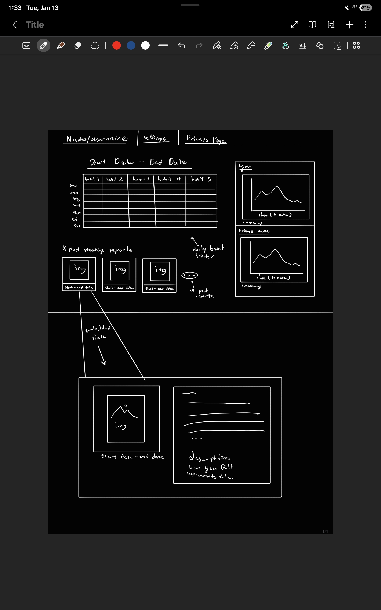
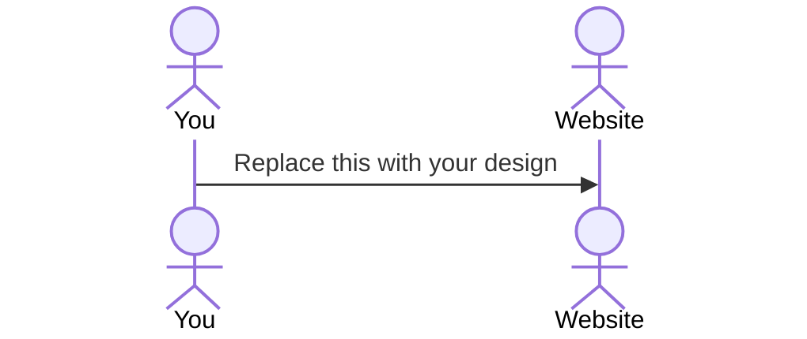

# Accountable

[My Notes](notes.md)

This website will help keep users accountable for the goals and resolutions they set at the beginning of the year by pairing with another user and completing actions such as weekly or daily check ins, submitting photos and weekly progress updates. The users may also decide rewards or punishments to add an extra layer of motivation. daily habits can also be tracked with this app through charts and graphs. 

> [!NOTE]
> This is a template for your startup application. You must modify this `README.md` file for each phase of your development. You only need to fill in the section for each deliverable when that deliverable is submitted in Canvas. Without completing the section for a deliverable, the TA will not know what to look for when grading your submission. Feel free to add additional information to each deliverable description, but make sure you at least have the list of rubric items and a description of what you did for each item.

> [!NOTE]
> If you are not familiar with Markdown then you should review the [documentation](https://docs.github.com/en/get-started/writing-on-github/getting-started-with-writing-and-formatting-on-github/basic-writing-and-formatting-syntax) before continuing.

## 🚀 Specification Deliverable

> [!NOTE]
> Fill in this sections as the submission artifact for this deliverable. You can refer to this [example](https://github.com/webprogramming260/startup-example/blob/main/README.md) for inspiration.

For this deliverable I did the following. I checked the box `[x]` and added a description for things I completed.

- [x] Proper use of Markdown
- [x] A concise and compelling elevator pitch
- [x] Description of key features
- [x] Description of how you will use each technology
- [x] One or more rough sketches of your application. Images must be embedded in this file using Markdown image references.

### Elevator pitch

Did you know that, according to a [2024 study](https://insideoutmastery.com/new-years-resolution-statistics/), nearly 80% of people abandon their New Year’s resolutions before February ends? This failure isn’t usually due to lack of desire but caused by vague goals, reliance on willpower alone, and the absence of real accountability or consequences. This app addresses those problems by pairing two people together to keep each other accountable for their goals. By sharing daily check-ins, progress, and responsibility, users introduce healthy external pressure that dramatically increases follow-through. And while accountability may begin as an extrinsic motivator, the app is designed to help users build consistent daily habits that naturally transition into intrinsic motivation over time.

Instead of relying on motivation that fades, this platform turns resolutions into routines.

"success is a product of our daily habits - not once in a lifetime transition" - James Clear author of Atomic Habits

### Key Features
- website integrating paring
    - users can privately pair with each other with an add code

- goal tracking
    - users define own goals
    - users define daily habits that will done to accomplish goals
        - generic daily habits (wake up time, distance for running, etc.) will be provided to streamline habit selection
    - both users can see goals and daily habits to do

- shared progress dashboard
    - side-by-side view of both users' goals and check-in status
    - progress of their daily habits are immediately visible to each other

- real-time updates
    - instantly update partner's and your dashboard

- accountability pokes 
    - users can send gentle reminders to their partners 

- Future developments
    - instead of using only add codes, match users dependent on things like goal compatibility, location, etc.

### Design

### Technologies

I am going to use the required technologies in the following ways.

- **HTML** - Build the core structure of the page (both the persons main page and a specific posts page) 
- **CSS** - style everything to create a better UI similar to a SM post. card layouts, photos, text, and spacing
- **React** - convert HTML/CSS into components and manage UI state and routing (routing )
- **Service** - Build backend and API endpoints react app calls (create/join par, creat/get weekly posts, upload/get img)
- **DB/Login** - store application data in database, pair codes, weekly posts, checkbox check ins
- **WebSocket** - When a cehckbox is clicked, update immedietly, posting weekly reflections also updates in real time

## 🚀 AWS deliverable

For this deliverable I did the following. I checked the box `[x]` and added a description for things I completed.

- [x] **Server deployed and accessible with custom domain name** - [My server link](https://startup.accountable.click).

## 🚀 HTML deliverable

For this deliverable I did the following. I checked the box `[x]` and added a description for things I completed.

- [x] **completed prereqs** simon deployed, github link, git commmits
- [x] **HTML pages** - home page (your main habit tracker), index(login page), friends habit tracker (websocket data), my resolution and goals (page and goal record)
- [x] **Proper HTML element usage** - used div and h1 for most lines
- [x] **Links** - all pages are accessible and backward traceable through links
- [x] **Text** - placeholder for resolution and habit tracker
- [x] **3rd party API placeholder** - placeholder for inspirational quote in my resolution and goals
- [x] **Images** - added image in homepage for motivation
- [x] **Login placeholder** - first page is the index page /login
- [x] **DB data placeholder** - input box and submit for login, home page is the place holder for the database which is your main habit tracker
- [x] **WebSocket placeholder** - your friends habit tracker will be displayed, can comment on there weekly habit tracker

## 🚀 CSS deliverable

For this deliverable I did the following. I checked the box `[x]` and added a description for things I completed.

- [x] **Visually appealing colors and layout. No overflowing elements.** - choose visually pleasing colors and a layout that's simple to navigate and organized 
- [x] **Use of a CSS framework** - implemented CSS framework for all html pages
- [x] **All visual elements styled using CSS** - all design implementations done through CSS
- [x] **Responsive to window resizing using flexbox and/or grid display** - used flex for displys in header layout
- [x] **Use of a imported font** - import quicksand font from cs260 api
- [x] **Use of different types of selectors including element, class, ID, and pseudo selectors** - used class and ID selectors for organization

## 🚀 React part 1: Routing deliverable

For this deliverable I did the following. I checked the box `[x]` and added a description for things I completed.

- [ ] **Bundled using Vite** - I did not complete this part of the deliverable.
- [ ] **Components** - I did not complete this part of the deliverable.
- [ ] **Router** - I did not complete this part of the deliverable.

## 🚀 React part 2: Reactivity deliverable

For this deliverable I did the following. I checked the box `[x]` and added a description for things I completed.

- [ ] **All functionality implemented or mocked out** - I did not complete this part of the deliverable.
- [ ] **Hooks** - I did not complete this part of the deliverable.

## 🚀 Service deliverable

For this deliverable I did the following. I checked the box `[x]` and added a description for things I completed.

- [ ] **Node.js/Express HTTP service** - I did not complete this part of the deliverable.
- [ ] **Static middleware for frontend** - I did not complete this part of the deliverable.
- [ ] **Calls to third party endpoints** - I did not complete this part of the deliverable.
- [ ] **Backend service endpoints** - I did not complete this part of the deliverable.
- [ ] **Frontend calls service endpoints** - I did not complete this part of the deliverable.
- [ ] **Supports registration, login, logout, and restricted endpoint** - I did not complete this part of the deliverable.

## 🚀 DB deliverable

For this deliverable I did the following. I checked the box `[x]` and added a description for things I completed.

- [ ] **Stores data in MongoDB** - I did not complete this part of the deliverable.
- [ ] **Stores credentials in MongoDB** - I did not complete this part of the deliverable.

## 🚀 WebSocket deliverable

For this deliverable I did the following. I checked the box `[x]` and added a description for things I completed.

- [ ] **Backend listens for WebSocket connection** - I did not complete this part of the deliverable.
- [ ] **Frontend makes WebSocket connection** - I did not complete this part of the deliverable.
- [ ] **Data sent over WebSocket connection** - I did not complete this part of the deliverable.
- [ ] **WebSocket data displayed** - I did not complete this part of the deliverable.
- [ ] **Application is fully functional** - I did not complete this part of the deliverable.
